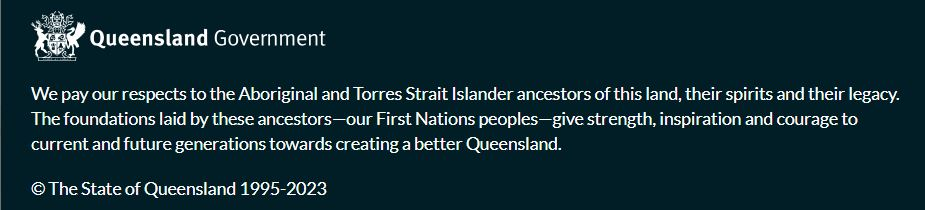
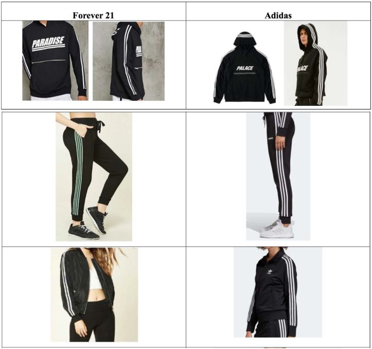

## Task 1

Vendor lock-in, also known as proprietary or customer lock-in, occurs when customers become dependent on a specific vendor's products or services, making it costly and challenging to switch to an alternative provider. This phenomenon is prevalent in cloud computing services like IaaS, PaaS, and SaaS, where organizations may utilize unique features offered by a particular vendor.

Advantages of vendor lock-in include the convenience and integration benefits of using a single vendor's ecosystem. Some vendors may also offer discounts for long-term commitments. However, it comes with disadvantages such as reduced negotiating power, potential price hikes, and limited flexibility to explore the best solutions in the market. The high switching costs, including data and application migration, pose significant challenges.

Technological lock-in, on the other hand, refers to a society's increasing reliance on a specific technology, making it less likely for users to switch. It can manifest as product, architectural, or skills lock-in, and it can provide stability and create barriers to entry for competitors. However, technological lock-in can limit adaptability to emerging technologies, incur high switching costs, and expose organizations to security risks if the technology becomes obsolete.

Commercial lock-in encompasses legal, provider exclusivity, and contractual lock-in, further complicating the ability to switch between vendors or technologies. These lock-ins often require careful consideration, as the advantages of stability and familiarity must be balanced against the risks and costs associated with reduced flexibility and potential dependencies.

References:
- https://www.geeksforgeeks.org/vendor-lock-in-in-cloud-computing/
- https://en.wikipedia.org/wiki/Vendor_lock-in 
- https://wiki.gccollab.ca/images/5/52/02_-_Lockin_EN.pdf

## Task 2

1. Because they take advantage of cognitive, behavioral, and social psychology, phishing attempts are common. They take use of trust in authority, use scarcity to create a sense of urgency, and rely on familiarity, according to cognitive psychology. They cause behavior such as curiosity, reciprocity, and habit building. Fear, social proof, and authority figures are all used in social psychology. These strategies play on people's prejudices and proclivities, increasing their susceptibility. Vigilance can be improved by understanding these psychological factors. Through security measures, employee education, and sophisticated email filters, businesses may combat phishing and reduce the risks brought on by these false attacks.

2. Social engineering uses cognitive, behavioral, and social psychology to skillfully manipulate individuals. It takes advantage of people's faith in authorities, encourages reciprocity by doing favors, and overburdens them with information. In order to get people to comply, it creates a sense of urgency and anxiety, takes use of the consistency bias, and employs social validation. To foster a sense of social acceptance, social norms, authoritative individuals, and group identity are all influenced. It is essential for people to comprehend these psychological concepts in order to spot and thwart social engineering activities. Businesses can increase employee education and cybersecurity knowledge to lower the likelihood of successful manipulation.

3. Utilizing secure passwords can be difficult due to cognitive, behavioral, and social reasons. Complex passwords are difficult to remember due to cognitive constraints, which results in inferior decisions. The difficulty of managing numerous strong passwords encourages the use of simpler options. People tend to put convenience first and frequently put off enhancing security, underestimating cyber threats. Password decisions are influenced by social conventions and peer pressure; if others use weak passwords, people may do the same. Social comparison breeds complacency when friends engage in similar behaviors. Organizations and cybersecurity specialists should give user-friendly authentication methods top priority and instruct users on the use of strong passwords and potential security threats in order to address these issues.

4. Due to cognitive, behavioral, and social reasons, PGP (Pretty Good Privacy) fails to be a successful approach for protecting email. Adoption is hampered by cognitive complexity and difficult-to-use interfaces. Its adoption is hampered by behavioral inertia and the hassle of requiring PGP from both sender and recipient. The network effect principle in social psychology is essential; PGP's effectiveness depends on widespread acceptance, which it has struggled to acquire. Additionally, consumers frequently underestimate the need for additional security due to their trust in well-known email services. To promote more adoption of secure email practices, PGP's effectiveness should be improved by emphasizing user-friendly interfaces, increased teaching, and addressing the network effect.

5. Because of cognitive, behavioral, and social psychological characteristics, malware spreads quickly. Individuals are influenced by cognitive biases like curiosity and trust to click on alluring links or believe messages that appear to be familiar. Impulsive behaviors are motivated by emotional triggers like haste and fear, while dangerous conduct is sustained by long-standing click-happy routines. By citing social proof (for example, "Many have downloaded this"), malicious messages take advantage of social psychology. When bad actors pretend to be trusted contacts, one's network can become vulnerable as a result of their trust. To combat these psychological tricks, cybersecurity education is crucial. It enables people to identify and avoid malware dangers.

## Task 3

### Task 3.A

**Intelectual property**

Intangible works of human creativity are included in the category of property known as intellectual property (IP) such as inventions, literary and artistic works, designs, symbols, names, and pictures used in business. 
Patents, copyrights, and trademarks are a few examples of IP protection under the law that allow people to profit financially, gain recognition from their inventions, or give a competitive advantage. The IP system seeks to provide an environment where creativity and innovation can thrive by striking the correct balance between the interests of innovators and the larger public interest.

**Copyright**

Original works of authorship fixed in a physical medium of expression are safeguarded by copyright law for a set amount of time. For instance, copyright protection gives authors, publishers, and producers as well as the general public the legal right to publish and sell works of literature, art, or music.  Both traditional (books, recordings, etc.) and digital (websites, electronic journals, etc.) media are covered by copyright laws. 
The eight types of works that are protected by copyright are as follows:
1. literary works
2. musical works
3. dramatic works
4. pantomimes and choreographic works
5. pictorial, graphic, and sculptural works
6. motion pictures and other audiovisual works
7. sound recordings
8. architectural works

A use case would be the copyright disclaimer in a computer software application. 

A user sharing a picture they found online on their Instagram account without asking permission or properly attribution is an example of copyright infringement on social media. The photographer's rights would still be violated even if the user had no intention of making money off the usage of the shot.

**Patent**

Patents are used to safeguard how things function. A patent is a privilege given for a brand-new, practical innovation. The sole authority to commercially exploit an innovation for the duration of a registered patent belongs to its owner. The owner also has the authority to provide licenses to others so they can produce, employ, or market the invention or any items derived from it.
Patent protection is not automatically granted, in contrast to copyright. It is necessary to file a formal patent application, and it is crucial that the innovation not be made public beforehand.

An example would be the Wright Brothers' patent for the airplane. A famous patent infringement is the BioNTech, Pfizer, Moderna and CureVac in major COVID-19 vaccine patent battle.

**Trademark**

A trademark is a symbol that is used (or intended to be used) in the course of commerce to identify a person or company's products or services from those of other companies. While trademark registration is not required, doing so can assist in protecting your rights by prohibiting rivals from using signs that are confusingly similar to yours. Trademark registration is perpetual as long as renewal payments are paid on time. Words, symbols, letters, numbers, names, signatures, phrases, sounds, fragrances, forms, characteristics of packaging, or a combination of these things can all be protected by a registered trademark. If your trademark consists of multiple components, only the entire trademark will be protected by a trademark registration.

A trademark infringement case is Adidas filing a lawsuit against clothing store Forever 21 on the grounds that the firm's use of the three-stripe logo on merchandise amounts to counterfeiting. Adidas asserts that it has spent millions on trademarking the three-stripe pattern and that it is covered by a number of patents.

**Non-Disclosure Agreements (NDAs)**

A Non-Disclosure Agreement (NDA) is a contract that has legal force. Under the terms of an NDA, everyone to whom you divulge confidential information is obligated to keep it hidden and confidential and not to use it improperly. Non-disclosure contracts are another name for non-disclosure agreements, as are confidentiality agreements and confidentiality disclosure agreements. One can come up at the start of a professional relationship or significant financial transaction. To safeguard sensitive information belonging to the company, a client or employer could require a new hire or contractor to sign a confidentiality agreement. In contrast to conventional commercial contracts like service or sales agreements, which concentrate on the terms and conditions of services or transactions, an NDA is primarily focused on protecting the privacy of an individual or organization's information. 

**Watermarks**

While keeping the artifact associated with its original creator, watermarking an intellectual property permits unrestricted exchange of digital content. The original creator of a digital piece might assert his or her authorship or copyright when the authorship is incorrectly assigned. A brand, piece of text, or pattern that has been purposefully put over another image is known as a watermark. 

A use case is Photographers watermark their images to deter unauthorized usage on websites or social media. 

**Software Licenses**

A software license is a piece of written or verbal legal documentation that regulates the use or redistribution of software. It is typically based on contract law. Except for software created by the United States Government, which is not protected by copyright under US law, all software is copyright protected, in both source code and object code forms.[1] Creators of copyrighted software have the option to donate their works to the public domain; in this event, the program is no longer protected by copyright and cannot be licensed.

A use case is Microsoft licenses its Windows operating system, dictating how it can be installed and used on computers.

**Digital Rights Management (DRM)**

The administration of authorized access to digital content is known as digital rights management (DRM). Access control technologies and other tools can limit the usage of proprietary hardware and works protected by intellectual property (TPM). DRM solutions control how copyrighted works (such as software and multimedia content) are used, modified, and distributed as well as how these restrictions are enforced by internal mechanisms in devices. DRM technology includes encryption and license agreements.

A use case is streaming platforms like Netflix use DRM to protect their video content from unauthorized distribution.

**Software Protection Dongles:**

A software protection dongle is an electronic copy protection and content protection device, also referred to as a dongle or key. They allow access to software features or decode material when linked to a computer or other electronic device. The hardware key connects to the computer or appliance's external bus by an electrical connector and is pre-programmed with a product key or other cryptographic protection mechanism. Dongles are two-interface security tokens with transient data flow that are used for software protection. A pull[clarification needed] connection reads security data from the dongle. Without these dongles, some software might only run in a limited mode or not at all. Dongles can allow features in electronic equipment, such as receiving and processing encoded video streams on televisions, in addition to software protection.

A use case is some high-end design and engineering software vendors use dongles to prevent software piracy.

### Task 3.B

The conflict between preserving intellectual property and having free information has occasionally resulted in the circumvention of protection measures. 

As the first safeguarding method, bypassing copyrights is considered. The problem is that copyright bypass has occurred frequently in the music industry, especially through internet file-sharing services. The lawsuit brought against Napster in the early 2000s is one of the most noteworthy cases. Users could share MP3 music files via Napster, a peer-to-peer file-sharing system. The idea that music should be freely available to everyone served as the foundation for Napster's actions and those of the users who shared copyrighted music on the service. They said that stringent copyright restrictions prevented musicians from becoming well-known and restricted the democratization of music distribution. At the end Napster and its users defended their behavior by claiming that rather than engaging in economic infringement, they were encouraging the sharing of music as a means of cultural exchange. They said that they were standing up for the values of information freedom and that the music industry's stringent copyright policies impeded creativity and access to art. As a result, major record labels on behalf of the music business sued Napster for copyright infringement. Due to legal pressure, Napster was forced to end its original service in 2001. Thoughts of freely sharing music continued, and as a result, BitTorrent and LimeWire and other file-sharing services grew in popularity. The music industry eventually adjusted by adopting legal streaming services like Spotify and digital distribution, which provided a compromise between copyright protection and consumer access.

As the second safeguarding method, bypassing software licenses is considered since software piracy, often known as licensing bypass, has long been a problem. One scenario that stands out was Adobe Photoshop.
Users of pirated or cracked versions of Adobe Photoshop, as well as the websites and forums where these versions were distributed were the entities. Users frequently complained that Adobe Photoshop's expensive price prevented aspiring designers and artists from using it. They felt that everybody should have unrestricted access to tools used by professionals. Some others claimed that they had less control over the tools they employed due to the software's subscription-based business model. As the justification those who pirated software defended their behavior by stating that they were not utilizing the software for financial gain but rather for personal or educational use. They claimed that by avoiding license limitations, they were democratizing access to creative tools and advancing digital literacy. At the end, Adobe has taken a number of steps to fight software piracy, including taking legal action against people and groups that distribute cracked copies of their products. To address some of the concerns about cost, Adobe also announced more reasonable subscription plans and student discounts. However, software piracy continues to be a problem, and the argument over whether it is better to protect software licensing or to make creative tools more widely available.

In both of these instances, a conviction in the principle of information freedom led to the circumvention of security measures like copyright and software licensing. Although some people and organizations claimed that everyone should have unfettered access to knowledge, their actions frequently ran afoul of moral and legal restrictions. These instances highlight the constant battle to achieve a balance between protecting intellectual property and making sure that individuals who might not be able to afford it can access knowledge.
