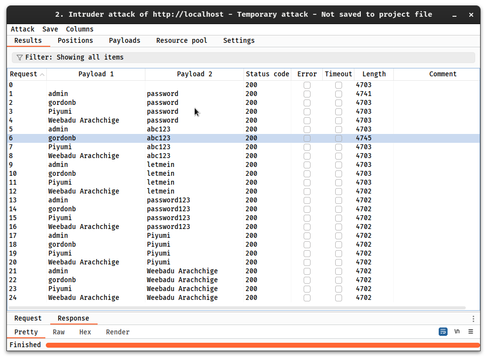

# Task 1

A side-channel attack (SCA) is a security exploit that attempts to extract secrets from a chip or a system. The attack is aimed to gather information from or influence the program execution of a system by measuring or exploiting indirect effects of the system or its hardware, rather than targeting the program or its code directly by analyzing physical parameters like supply current, execution time, or electromagnetic emissions.  These attacks pose a significant threat to systems incorporating cryptographic components, as they can compromise even robust cryptographic algorithms by exploiting unintentional information leakage.

Various side-channel attack methods exist with some common examples. **Timing Attack** which analyzes the time a system takes to execute cryptographic algorithms, potentially revealing sensitive data. **Electromagnetic (EM) Attack** attacks involve measuring and analyzing electromagnetic radiation emitted by a device, providing insights into its cryptographic operations. **Simple Power Analysis (SPA)** directly observes power and electromagnetic variations during cryptographic operations, seeking patterns that can unveil secret information. **Differential Power Analysis (DPA)** gathers and statistically analyzes data from multiple cryptographic operations, identifying patterns that expose cryptographic keys. **Template Attack** recovers cryptographic keys by exploiting a template device with known characteristics and comparing its side-channel data to the target device. 

Side-channel attacks have evolved over the years, expanding beyond traditional targets like printers and encryption machines. An example of such an attack is the MI5 operation during the Suez crisis. In 2004, IBM researchers demonstrated that even seemingly identical-sounding keys on computer keyboards could be exploited. They used a parabolic microphone to capture acoustic differences, and a neural network achieved a 79 percent success rate in distinguishing key sounds. This research highlights the risk of attackers using these techniques to capture user login credentials, though they would need physical proximity to the target. Possible mitigation methods include using touchscreen or rubber keyboards.

# Task 2

Slowloris is a cunning application-layer Distributed Denial of Service (DDoS) attack that singles out web servers for disruption. Unlike conventional DDoS attacks that disrupt entire networks, Slowloris is fine-tuned to exclusively target web servers. It achieves this by utilizing partial HTTP requests to establish connections between a single attacker-controlled computer and the web server, then protracts these connections to exhaust the server's resources, rendering it unresponsive. What distinguishes Slowloris is its frugal bandwidth requirement, making it an accessible option for attackers. Detecting Slowloris attacks can be a challenge, but crucial signs include identifying clusters of connection attempts, extended connection durations, a surge in partial HTTP requests, elevated server resource utilization, and other irregularities tied to bandwidth and capacity. Crucially, while experimental checks exist to uncover server susceptibilities to Slowloris attacks, their real-world efficacy hinges on factors like server configuration and connection quality, rendering them susceptible to inaccuracies and false positives. Load testing remains the most pragmatic means to gauge a web server's resilience against slow HTTP attacks, categorizing it as a configuration concern rather than a standard web vulnerability.

Slowloris attacks can escalate into Distributed Denial of Service (DDoS) when incoming requests originate from multiple sources, such as a botnet. Notably, Slowloris attacks fall under the category of application-layer DDoS attacks and contrast with network-layer attacks like SYN flood attacks. Traditional network-level DDoS protection methods are ineffectual against slow HTTP DoS attacks. As an illustrative case, in 2011, the hacker group LulzSec purportedly targeted the CIA's website with a Slowloris attack, causing it to be inaccessible for several hours.


# Task 3

## Task 3.1

The BurpSuite was run and below are the results. The listing of the last POST and GET request including timestamps, port and the entire edited POST request in Raw format.


## Task 3.2

The response's HTML code includes a form with a "Generate" button. By pressing this button, a server-side function that creates a fresh "dvwaSession" cookie with an updated value, such as a timestamp or a counter, is probably started. Every time I send the request, the "dvwaSession" cookie's value is updated. The data appears to be a timestamp or session identification in numeric form that grows by a specific amount of seconds between new sessions. 


## Task 3.3

|Payload set 1|Payload set 2|
|----|----|
|||

The different Length (4741 & 4745) from the others (4702 & 4703) indicates the correct username and password.



There were 2 successfull attacks. 
1. Username: _admin_ & Password: _password_


2. Username: _gordonb_ & Password: _abc123_


## Task 3.4

Text: `Piyumi Weebadu Arachchige 2304801`

Encoded as URL: `%50%69%79%75%6d%69%20%57%65%65%62%61%64%75%20%41%72%61%63%68%63%68%69%67%65%20%32%33%30%34%38%30%31`


Encoded as HTML: `&#x50;&#x69;&#x79;&#x75;&#x6d;&#x69;&#x20;&#x57;&#x65;&#x65;&#x62;&#x61;&#x64;&#x75;&#x20;&#x41;&#x72;&#x61;&#x63;&#x68;&#x63;&#x68;&#x69;&#x67;&#x65;&#x20;&#x32;&#x33;&#x30;&#x34;&#x38;&#x30;&#x31;`


## Task 3.5

The edited command: 
```terminal
docker run --network="host" vanhauser/hydra -V -f -I -l admin -x 1:2:a "http-get-form://localhost/vulnerabilities/brute/:username=^USER^&password=^PASS^&Login=Login:H=Cookie:PHPSESSID=kq220l1ne93che952bnuvq0ks5; security=low:F=Username and/or password incorrect."
```

The output when the MIN=1 and MAX=2:


Below are the results after I changed the password in CSRF. 

The hydra command:
```terminal
docker run --network="host" vanhauser/hydra -V -f -I -l admin -x 1:4:a "http-get-form://localhost/vulnerabilities/brute/:username=^USER^&password=^PASS^&Login=Login:H=Cookie:PHPSESSID=kq220l1ne93che952bnuvq0ks5; security=low:F=Username and/or password incorrect."
```


The password is identified as: `burn`

The process took around 12 minutes. 

Thank you!
