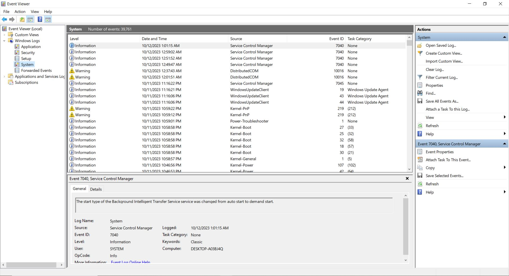

# Task 1

**1. Intrusive application practices:**
- Harmful applications have the ability to gather and leak a variety of data, including user- and device-generated data.
- Malicious programs may escalate their privileges in order to gain access to saved data.
- Due to employee autonomy in downloading programs, the likelihood of these hazards is extremely high.
- The potential impact is significant, particularly for private company information.
- Users may unintentionally install dangerous programs in BYOD environments, posing hazards to the device and company data.

**2. Account credential theft through phishing:**
- Phishing is a danger that frequently targets users and uses phony websites to obtain account information.
- Social engineering methods and website impersonation are key components of phishing.
- Phishing assaults are quite likely to occur, and they can have a big impact.
- BYOD raises particular dangers since device-level security measures might not shield users from emails and texts that could be vulnerable.
- Effective email and message controls are crucial to preventing unwanted access to corporate data.

**3. outdated phones**
- Malware can get elevated privileges by utilizing code execution flaws in mobile OS or device drivers.
- Advanced attackers might set up more harmful tools, create persistence, and conduct subsequent attacks.
- Because mobile devices have a history of having vulnerabilities, the possibility of such attacks is significant.
- Due to the ability to circumvent security measures and change protected data, the impact is significant.
- If BYOD devices are not properly updated and maintained, they are susceptible to this threat.

**4. sensitive data transmissions**
- Wireless networks that are not encrypted put data transmission at risk.
- Unencrypted data is vulnerable to eavesdropping and unlawful access by malicious parties.
- Due to the user effort and awareness required to establish security measures, the chance of such assaults is moderate.
- With the possibility for device control and network traffic decryption, the impact is very great.
- Because there is no always-on device-wide VPN in a BYOD environment, application communications are at the developer's discretion.

**5. Brute-force attacks to unlock a phone**
- The safety of data from PIN brute-force attacks is an issue.
- Brute-force attacks, side-channel attacks, and direct surveillance are all threats.
- Because of built-in preventative measures, brute-force attacks are less frequent.
- Unauthorized access to corporate data could result from a successful attack.
- The risk of password compromise may rise in BYOD scenarios due to the variety of surroundings.

**6. Application credential storage vulnerability**
- Data security may be at danger from improper application development procedures.
- Unauthorized access to mobile devices could give users access to internally developed programs with security flaws.
- Default admin passwords and other hardcoded credentials may be included in internal applications.
- Due to the frequent maintenance of default passwords, the possibility of this risk is moderate.
- The impact is significant since successful credential extraction could result in unauthorized access to company data.

**7. Unmanaged device protection**
- Access to the enterprise through unmanaged devices comes with a big risk.
- Enterprise data is at risk because these devices lack crucial security features.
- Compromises may result from a lack of awareness into the security posture of unmanaged devices.
- Security regulations can be broken, allowing unauthorized access to critical information and services.
- Regardless of the mobile deployment scenario, there is always a danger of unmanaged device access.

**8. Lost or stolen data protection**
- Due to their compact size, mobile devices run the danger of being misplaced or stolen.
- If the gadget doesn't have sufficient security measures in place, unauthorized access to sensitive data may happen.
- No matter who owns the equipment, theft or loss are quite likely occurrences.
- The impact is significant because nefarious individuals in possession of the gadget could access private company information.
- The mobility of BYOD settings may increase the danger of gadgets being stolen or lost.

**9. Protecting enterprise data from being inadvertently backed up to a cloud service**
- There are substantial hazards associated with storing sensitive data in unmanaged cloud services.
- Loss of data control puts availability, integrity, and secrecy at risk.
- An outcome could be unauthorized access by malicious parties.
- Data management policy violations could result in legal problems and make recovery attempts more difficult.
- Whether deliberate or unintentional, such behaviors are likely to occur, and BYOD settings may raise the possibility of unintentional data backup to unmanaged cloud services.

# Task 2

There are a number of side-channel attacks discovered, and Foreshadow, Lazy FP state restore, and Microarchitectural Data Sampling (MDS) are all side-channel attacks that exploit the speculative execution and microarchitectural features of modern CPUs to steal sensitive data.

Foreshadow exploits a vulnerability in Intel's speculative execution engine, called the Branch Target Buffer (BTB), to steal data from memory. The BTB stores the addresses of recently predicted branches, and Foreshadow can use this information to read data from memory that should be inaccessible.

Lazy FP state restore is a vulnerability in AMD's floating-point unit (FPU) that allows attackers to steal data from the FPU registers. The FPU registers are used to store floating-point numbers, and Lazy FP state restore can be used to read this data even if the program has not explicitly saved it to memory.

MDS is a family of vulnerabilities that exploit the microarchitectural features of modern CPUs to steal data from memory. MDS can be used to steal data from a variety of sources, including the L1 cache, the branch history table, and the store buffer.

The following table compares Foreshadow, Lazy FP state restore, and MDS on various aspects such as differences, targets, etc. 

|Feature|	Foreshadow |	Lazy FP state restores |	MDS |
|---|---|---|---|
|Type of data stolen|	Memory|	Memory|	Memory and CPU microarchitectural features|
|Systems targeted	|Intel CPUs|	AMD CPUs|	Intel, AMD, and ARM CPUs|
|Mitigations|	Software patches, hardware mitigations, microcode updates	|Software patches, hardware mitigations, microcode updates|	Software patches, hardware mitigations, microcode updates|

The mitigations that can be used to protect against Foreshadow, Lazy FP state restore, and MDS are the same as mentioned above in the table. The explanation for each method is briefly described:

* Software patches: Software patches can be applied to the operating system and applications to fix the vulnerabilities that are exploited by these attacks.
* Hardware mitigations: Hardware mitigations can be implemented in CPUs to make them more resistant to these attacks.
* Microcode updates: Microcode updates can be applied to CPUs to fix the vulnerabilities that are exploited by these attacks.

As conclusion, it can be mentioned that Foreshadow, Lazy FP state restore, and MDS are all serious security vulnerabilities that can be used to steal sensitive data from modern CPUs. There are a number of mitigations that can be used to protect against these attacks, but it is important to note that these mitigations may have a performance impact.

# Task 3

I have Windows 10 installed on my PC and here are the details regarding the effect of common vulnerabilities on my OS and the functions against the vulnerabilities by the OS.

|Vulnerability|Harm|Windows|Extenal tools|
|---|---|---|---|
|**Malware and Viruses**|Malware and viruses can cause a variety of harm to the computer, including, data theft where malware and viruses can steal personal and financial information, such as passwords, credit card numbers, and Social Security numbers, data corruption by making them unusable or even deleting them completely, system disruption by Malware and viruses can disrupt the computer's operation, causing it to run slowly or even crash and ransomware attacks which is a type of malware that encrypts the files and demands a ransom payment in exchange for the decryption key.| Windows has a number of built-in features to mitigate malware and viruses, including, Windows Defender Antivirus is a free antivirus program that is pre-installed on all Windows computers. It provides real-time protection against malware and viruses, and it is regularly updated with new signatures to detect new threats, Windows SmartScreen helps to protect from phishing websites and malicious downloads. It does this by checking the reputation of websites and downloads before opening them and Windows Defender Firewall helps to protect the computer from unauthorized access. It does this by blocking incoming traffic from untrusted sources.| Third-party antivirus programs, anti-malware scanners, and web filtering software|
|**Exploiting Software Vulnerabilities**|Attackers can exploit software vulnerabilities to gain access to the computer and steal the data, install malware, or take control of the system.|Windows Update is a built-in tool that can be used to install security updates for Windows and other Microsoft software. Automatic updates should be enabled to ensure that the system is always up to date with the latest security patches.| - |
|**Phishing and Social Engineering**|Phishing and social engineering scams are designed to trick into revealing sensitive information, such as user's passwords, credit card numbers, or social security numbers. | Windows Defender SmartScreen is a built-in feature that can help to protect from phishing websites.|Phishing protection tools can help to block phishing websites and emails.|
|**Drive-by Downloads**|Drive-by downloads are malicious files that are downloaded to a user's computer without the user's knowledge or consent. These files can be installed on a user's computer and can cause a variety of harm, including malware infection, data loss, and system damage. | Windows Defender SmartScreen can help to protect users from drive-by downloads.|Drive-by download protection tools can help block malicious files from being downloaded to the user's computer.|
|**Zero-Day Exploits**|Zero-day exploits are vulnerabilities that are unknown to the software vendor, so there is no patch available to fix them. This makes them very dangerous, as attackers can exploit them without fear of being detected. Zero-day exploits can be used to steal data, install malware, or even take control of a user's computer. |Windows Defender Exploit Guard is a built-in feature that can help protect users from zero-day exploits. | There is third-party security software, such as Malwarebytes or Emsisoft Anti-Malware, to help protect users from zero-day exploits. |
|**USB/Removable Media Attacks**|The use of USB sticks and other removable media can be exploited to steal data or infect a user's machine with malware. Infected portable media can be left in public locations like coffee shops and libraries by attackers in the hopes that someone will take them and insert them into their computers. Additionally, attackers have the ability to mail victims infected removable media devices. | Windows Defender SmartScreen can help protect the user from infected removable media devices. People should also be careful about plugging in removable media devices that can be found in public places or that can be received from unknown senders. | Security software can help to protect you from infected removable media devices by detecting and blocking malicious activity. |
|**Password Cracking**|If an attacker cracks a password, they can gain access to online accounts, email, and other sensitive information. Attackers can use this information to steal identity, commit fraud, or even blackmail. | Windows 10 and later versions of Windows come with a built-in feature called Windows Hello, which allows to log in to your computer using your fingerprint, face, or PIN. Windows also has a built-in password manager that can help to create and manage strong passwords.| Password managers can help to create and manage strong passwords for all of the online accounts and to keep them safe and secure.|

# Task 4

## 1. 

**Application logs**

Application logging involves creating files containing information about events within a software application. These logs, generated by the application, encompass errors, warnings, and informative events. The content and format of these logs are determined by the software developers, who decide which events to log and how to structure them. While specific log details vary across applications, typical components include context information for understanding the application's state, timestamps for issue tracking, and log levels like INFO, WARN, and ERROR to indicate the entry's importance. Logging helps developers monitor and diagnose application behavior during development and prior to release.

**Event logs**

The Windows event log is a comprehensive record of system, security, and application-related events in a Windows operating system. It aids network administrators in identifying potential issues that may impact performance. Event logs are standardized for clarity. Key elements include the log name (system, security, applications), event date and time, task category indicating the type of event, unique Event ID, source (program responsible), severity level (information, error, warning, critical), user name, and the logging computer's name. These logs offer insights into system health, security threats, and application performance, assisting administrators in troubleshooting and proactive problem-solving.

**Service logs**

Directory service logs are generated by domain controllers in a Windows Server domain, capturing vital information about user privilege modifications, authentication activities, requests, and other operations within Windows Active Directory. These logs play a crucial role in maintaining security and operational integrity. Additionally, domain controllers produce file replication service logs, exclusive to them, which document file replication activities occurring on the computer. These logs are indispensable for monitoring and ensuring the efficient replication of files within the domain controller's network, contributing to data consistency and availability. Both types of logs are essential components of maintaining a well-functioning and secure Windows Server environment.

**System logs**
Windows system event log contains events related to the system and its components. Failure to load the boot-start driver is an example of a system-level event.

## 2. 
In Windows, the event logs are stored in the C:\WINDOWS\system32\config\ folderIn Windows, the event logs are stored in the `C:\WINDOWS\system32\config\` folder.

## 3. 
Monitoring and managing various logs is crucial for maintaining the security and integrity of an application's infrastructure:

- **Application Logs**

These logs, unique to each application, contain a wealth of information, including API, service, and client-side logs. Monitoring caller IP addresses helps identify scanning attacks, and logs should flag suspicious activities to prevent unauthorized procedures. Application infrastructure security is equally important.

- **Infrastructure Logs**

Monitoring cloud provider logs and orchestrator logs, such as Kubernetes, is vital for tracking activities in the application environment. OS/container logs can detect malfunctions and offensive usage.

- **Database Logs**

Database transaction logs, replication logs, and event logs provide insights into data status, integrity, and confidentiality. Monitoring these logs helps pinpoint issues and root causes.

- **Monitoring Systems Logs** Monitoring tools maintain application services' status and can detect security attacks. Ensure logs are protected from manipulation by sophisticated attackers.

- **Security Systems Logs** Security tools like WAF and DDoS protection systems should be carefully monitored. Audit logs containing activity, configuration changes, and traffic must be reviewed to prevent breaches.

- **Private Network Security and Logs**

Vulnerabilities often exist in private networks, making monitoring critical.

- **Firewall Logs**

Firewalls protect the office network, and any unsanctioned configuration changes should trigger an investigation.

- **Mailing System Audit Logs**

Email communication is a common vector for social engineering attacks. Mailing system audit logs should be reviewed for any suspicious activity, configuration changes, or breaches.

- **Employees' Endpoint Antivirus Logs**

Antivirus and protection software logs on employees' devices are essential. Monitoring these logs helps detect and prevent potentially destructive events that could compromise security.

Effective log monitoring and management across these layers enhance an application's security and threat detection capabilities.

## 4. 

The system logs in Windows 10 can be monitored as per below. 

Type "Windows key" --> Search for "Event Viewer"

**References:**

* https://www.xplg.com/application-logs-what-how/#:~:text=Put%20simply%2C%20an%20application%20log,as%20well%20as%20informational%20events.
* https://www.sumologic.com/glossary/log-file/#:~:text=Log%20files%20are%20the%20primary,application%2C%20server%20or%20another%20device.
* https://www.solarwinds.com/resources/it-glossary/windows-event-log
* https://logz.io/blog/logs-to-monitor-for-security-analytics/

