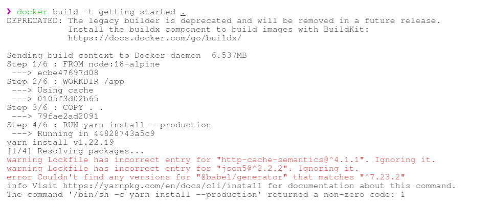

# Task 1

TPM is a hardware-based security module that securely stores cryptographic keys, authenticates platform devices, ensures system integrity, and supports remote attestation. It has robust security capabilities, making it a foundational tool for securing hardware and data. TPM has some limitations as well. TPM relies on the integrity of the hardware it's embedded in. If the underlying hardware is compromised, TPM's security is at risk. Also TPM is primarily designed for system-level security and key management, so it may not address all security needs, such as application-level vulnerabilities. Although TPM enhances security, it cannot prevent all possible threats or social engineering attacks. 

On the other hand, secure enclaves like Intel SGX and Arm TrustZone create isolated execution environments within processors, ensuring code and data confidentiality and integrity. They are robust for certain use cases, but they have their own set of limitations. Enclaves are dependent on specific processor architectures (e.g., Intel SGX or Arm TrustZone), limiting their availability to compatible hardware. This can be a drawback for systems without these processors. Enclaves have limited memory space, restricting the volume of data and operations that can be secured within them. The security of enclaves relies on the correctness and security of the code running inside. Vulnerabilities or compromises in this code can undermine the security of the enclave. Creating and configuring enclaves is complex, and proper implementation is crucial. Mistakes can lead to security issues.

TPM and secure enclaves offer robust security features, but their effectiveness is tied to the hardware they run on and the correct implementation of their security mechanisms. TPM primarily focuses on system-level security, while secure enclaves target specific applications and data protection, making them valuable tools, but not universal solutions for all security needs. Understanding these limitations is essential for deploying them effectively in various security contexts.

Resourses:
https://www.wolfssl.com/difference-hsm-tpm-secure-enclave-secure-element-hardware-root-trust/

# Task 2

A supply chain assault occurs when an outsider gains access to your systems and data and utilizes them to compromise your digital infrastructure. The attacker just needs to breach the defenses of the third party or program a vulnerability into a vendor-provided solution in order to gain access to your system because the outside party has been given permission to use and manipulate specific portions of your network, your applications, or sensitive data. The figure 1 shows the basic flow of supply chain attack. Maintaining the integrity of our networking hardware and software is critical in a multi-actor, intricate supply chain. 


In this case the supply chain is as follows. 

Hardware:
- A third party company X manufactures the RAM and ROM for the router.
- The Y company transports the hardware.
- Our company assembles the devices.
- Company Z audits the hardware. 
- Y comany transports the devices to resellers.

Software: 
- Company A provides the software developers.
- Own employees audits and consults the software. 
- Company C hosts internal tools.

In order to prevent supply chain attacks, there are few measures that we can proceed with.

**1. Audit Unapproved Shadow IT Infrastructure:** Evaluate the unmanaged IT services used by employees to identify potential vulnerabilities. This may include overlooked security software or communication tools that supply chain attackers could exploit.

**2. Assess Vendor Security Posture:** Request comprehensive security information from vendors and have cybersecurity professionals assess its adequacy. Understanding vendor security measures provides insights into product safety. Use technologies like TPM (Trusted Platform Module) to verify the integrity of components.

**3. Treat Supplier Risk Assessment as Ongoing:** Continuously assess and verify the security of each supplier. A previously safe supplier may become a source of attacks, emphasizing the need for continuous evaluation.

**4. Deploy Endpoint Detection and Response (EDR) Solutions:** Safeguard endpoints against infiltration with EDR systems, which offer robust protection and prevent the spread of supply chain attacks within the network.

**5. Implement Strict Code Integrity Policies:** Enforce code dependency policies that dictate which applications are permitted to run. This minimizes the risk of supply chain attacks, even if it occasionally flags legitimate apps.

**6. Maintain a Secure Build and Update Infrastructure:** Regularly apply security patches to operating systems and software, and restrict the execution of trusted tools. Implement multi-factor authentication (MFA) for admin access.

**7. Third-Party Oversight:** Employ User Behavioral Analytics (UBA) to monitor and detect unusual or unauthorized activities within our systems, particularly those related to third-party involvement. Promptly investigate and remediate any suspicious behavior.

To sum up, supply chain security is a continuous process that necessitates thorough planning and a multifaceted strategy to reduce risks. Our business can greatly improve the security of our networking gear and software across the supply chain by putting the suggested activities into practice and taking care of any potential issues, earning the respect and confidence of our partners and clients.

Reference:
https://www.fortinet.com/resources/cyberglossary/supply-chain-attacks 

# Task 3

## A. 

I used hadolint docker container. 

The Dockerfile before fixes:

```dockerfile
# Use a base image with Ubuntu, which is similar to the CI environment
FROM ubuntu:latest

#Default directory
WORKDIR /ProjectX


RUN apt-get update && \
    apt-get install -y --no-install-recommends python3 git curl clang lcov zip && \
    apt-get clean && \
    rm -rf /var/lib/apt/lists/*

RUN which clang

RUN curl -L https://github.com/bazelbuild/bazelisk/releases/latest/download/bazelisk-linux-amd64 -o /usr/local/bin/bazel && \
    chmod +x /usr/local/bin/bazel

RUN which bazel
RUN bazel --version

RUN sh -c "$(curl -fsSL https://raw.githubusercontent.com/CodeIntelligenceTesting/cifuzz/main/install.sh)"

# Copying local directories and files instead of cloning from a repo
RUN mkdir ProjectX2
COPY . /ProjectX/ProjectX2

WORKDIR /ProjectX/ProjectX2
RUN ls -a

CMD ["sh", "-c", "cifuzz run test:test --use-sandbox=false > /ProjectX/ProjectX2/fuzzing.log 2>&1 && cat /ProjectX/ProjectX2/fuzzing.log && cifuzz finding && cifuzz coverage test"]
```

The fixes that `hadolint` suggested.


The Dockerfile after fixes:

```dockerfile
FROM ubuntu:22.04.3

WORKDIR /ProjectX

RUN apt-get update && \
    apt-get install -y --no-install-recommends python=3 git=2.42.0 curl=8.4.0 clang=16.0.6 lcov=2.0-1 zip=3.0 && \
    apt-get clean && \
    rm -rf /var/lib/apt/lists/* && \
    curl -L https://github.com/bazelbuild/bazelisk/releases/latest/download/bazelisk-linux-amd64 -o /usr/local/bin/bazel && \
    chmod +x /usr/local/bin/bazel && \
    sh -c "$(curl -fsSL https://raw.githubusercontent.com/CodeIntelligenceTesting/cifuzz/main/install.sh)" && \
    mkdir ProjectX2 && \

COPY . /ProjectX/ProjectX2

WORKDIR /ProjectX/ProjectX2

CMD ["ls", "-a", "sh", "-c", "cifuzz run test:test --use-sandbox=false > /ProjectX/ProjectX2/fuzzing.log 2>&1 && cat /ProjectX/ProjectX2/fuzzing.log && cifuzz finding && cifuzz coverage test"]
```

The `hadolint` output after fixes:


## B.

I used the `Trivy` docker container. 

The result:


The image I used is taken from the Docker docs. The link: https://docs.docker.com/get-started/02_our_app/

The `yarn.lock` file before fixes is attached to [here.](src/getting-started-before/yarn.lock)

The `yarn.lock` file after fixes is attahed [here.](src/getting-started-after/yarn.lock)

Although the data is changed to the mentioned versions in the Trivy output the docker image is not created and prducing below errors. 



## C. 

I couldn't figure out below error. :(


