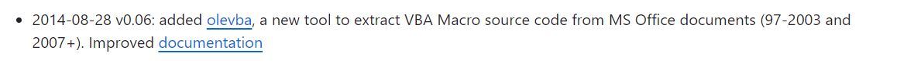
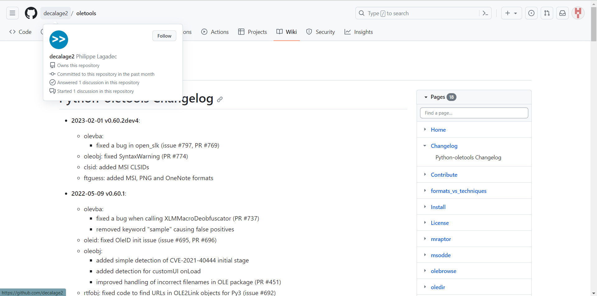
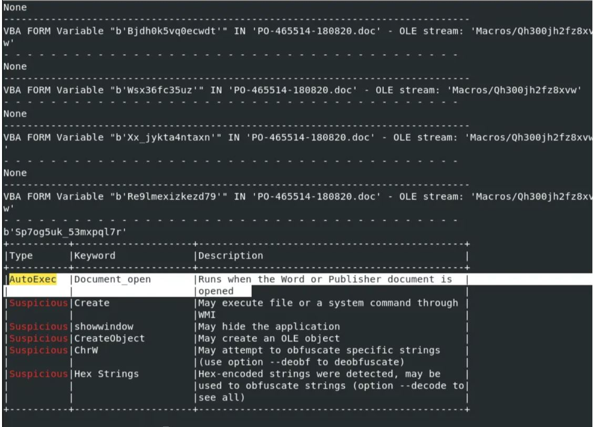

# Task 1

New safety concerns in the medical equipment and automotive industries can sometimes be overlooked for several reasons. One primary factor is the **rapid pace of technological advancement**. As these industries embrace new innovations, there is often a strong focus on improving **performance**, **functionality**, and **cost-effectiveness**. This intense drive for progress can lead to a degree of oversight regarding **safety considerations**.

Another significant reason for overlooking safety concerns is the **pressure to meet tight deadlines** and **cost constraints**. Both industries are highly competitive, with companies striving to release products as quickly as possible and within budget. This can result in shortcuts or compromises related to safety, especially when there is a **lack of comprehensive safety regulations** and **enforcement**.

Additionally, there can be a **resistance to acknowledging new safety issues** due to the **fear of financial repercussions**. Manufacturers and developers may be hesitant to admit flaws in their products, as it could lead to **recalls**, **lawsuits**, and damage to their reputation. This defensive approach can hinder the identification and resolution of safety concerns.

Sudden changes in these industries are often triggered by **high-profile incidents** or **regulatory interventions**. For example, a publicized **accident involving a new automotive technology** may lead to immediate safety improvements. Similarly, **medical equipment may face sudden scrutiny and regulatory changes** after a **patient safety incident** gains public attention. These events force the industry to prioritize safety, often leading to improved safety standards and practices.

In summary, the **rapid evolution**, **time and budget constraints**, and **fear of financial consequences** can contribute to the oversight of safety concerns in the medical equipment and automotive industries. Sudden changes are typically triggered by significant incidents or regulatory actions that draw attention to the need for improved safety measures.

# Task 2

**Static analyzers** are utilized in development to scrutinize source code, examining its structure, syntax, and data flow without execution. They uncover potential issues, coding errors, and style violations, promoting well-structured and error-free code. These tools provide a comprehensive overview, ensuring coding consistency in team development and producing fewer false positives.

**Dynamic analyzers** work during code execution, necessitating runtime or test scenarios. They monitor program behavior, memory usage, and interactions, focusing on runtime issues like memory leaks and security vulnerabilities. Dynamic analyzers are vital for identifying runtime problems but tend to yield more false positives, particularly in security analysis, relying on specific execution paths.

**Advantages:**
1. Testing tools provide a cost-effective means of ensuring software quality, offering a high level of assurance for the system.
2. Unit tests enable the early detection of issues, reducing the likelihood of late-stage problems.
3. Integration tests help prevent code changes from reintroducing old bugs, maintaining software reliability.
4. Integration tests serve as a gate for automated deployments, ensuring that code with known issues is not deployed.
5. Integration tests use real interfaces, verifying that the system behaves as expected in a production-like environment.
6. Testing tools emphasize secure management of sensitive data and credentials, contributing to overall system security.
7. Testing from the beginning of the development process aligns with the "fail-fast" principle, minimizing technical debt and enhancing software reliability.

**C linters** are static analysis tools used in software development for various programming languages. They focus on enhancing code quality by identifying issues, errors, and style problems before execution. C linters enforce coding standards, detect code smells, and enhance code readability. They offer customization, support collaboration, and may suggest performance improvements. Tools like Clang-Tidy and Error Prone are widely used for maintaining high-quality, error-free code in languages like C++ and Java.

# Task 3

**Potential End User/Buyer:**

For the potential end users or buyers of a security-certified product, the incentives are primarily driven by the desire for safety and trust. They seek certified products to ensure that their personal data, sensitive information, and overall well-being are protected. The incentive here is peace of mind. They want to know that the product they're investing in meets certain security standards, reducing the risk of cyberattacks, data breaches, and privacy violations. Incentives for them also include regulatory compliance, as using certified products can help organizations adhere to data protection laws and industry regulations.

**Certifying Authority (Both Vendor-Funded and Non-Profit):**

Certifying authorities play a crucial role in the security certification process. Vendor-funded labs often receive monetary incentives from manufacturers, which can create conflicts of interest. This vendor-dependent model can be problematic, as labs may be inclined to provide favorable assessments to maintain financial support. On the other hand, non-profit certifying authorities prioritize objective evaluations. Their incentive lies in maintaining credibility and trust within the industry. By offering unbiased certifications, they establish themselves as reliable sources for assessing security. Transparency, integrity, and a commitment to rigorous testing are the key motivators for non-profit certifying authorities.

**Manufacturer:**

Manufacturers have their own set of incentives when seeking security certification for their products. A certified product can gain a competitive edge in the market, attracting security-conscious customers. Incentives for manufacturers also include risk reduction. Certification helps mitigate the risk of security flaws, breaches, and potential liabilities, which could be financially devastating. Moreover, it can enhance a manufacturer's reputation for producing secure and trustworthy products, ultimately leading to increased sales and customer loyalty.

In the rapidly evolving field of security certification, it's essential to align these incentives. While end users aim to protect their interests, certifying authorities should prioritize impartial assessments, and manufacturers seek to enhance their products' security and reputation. Striking a balance among these stakeholders ensures that security certifications maintain their integrity and effectiveness. It's a collective effort to foster a more secure digital landscape.

# Task 4

The Cybersecurity Label is a certification aimed at ensuring that connected smart devices and services meet specific information security standards established by the National Cyber Security Centre Finland (NCSC-FI) at Traficom. This certification primarily targets consumer-oriented smart devices, including products like smart TVs, smart bracelets, and home routers. Its primary goal is to empower consumers to make informed and secure choices when selecting these products and services.

When a product or service features the Cybersecurity Label, it indicates that it has undergone a comprehensive evaluation by the independent NCSC-FI. This evaluation focuses on the information security features of the product, aiming to protect users and their data from common threats on the internet. Alongside the certification, the product provides user-friendly instructions on how to securely operate it and shares technical information about the methods employed to ensure information security.

However, it's important to recognize that, no security system can guarantee absolute protection. Most data breaches occur due to weaknesses in the design or usage of a product or service. By addressing these fundamental issues, it's possible to significantly reduce security vulnerabilities and minimize potential damage.

The Cybersecurity Label has been granted to a wide range of products from various companies. These include fitness watches, routers, and heating adjusters, among others. The application process for this label is straightforward, with detailed instructions and requirements available on their website. The Cybersecurity Label emphasizes a two-pronged approach: the need for both secure devices and informed users. Even the most secure devices can become vulnerable if not used correctly. Therefore, it encourages users to become proficient in managing the information security features of their smart devices to ensure safe and secure usage.

In essence, the Cybersecurity Label serves as a mark of assurance for potential buyers. It signals that manufacturers have given the utmost priority to the information security of their products and services. It's a valuable tool for consumers navigating the ever-expanding world of smart devices. While achieving absolute security is an unattainable goal, addressing fundamental security issues can significantly reduce risks and protect user data.

The concept of a cybersecurity certificate for smart devices is a commendable step toward bolstering consumer confidence in an increasingly interconnected world. Knowing that a product adheres to specific security standards might justify paying a premium, especially in light of the growing importance of online security. Nevertheless, potential challenges may arise in assessing the effectiveness of the certification process and its ability to adapt to evolving cyber threats. The credibility of the certificate hinges on rigorous evaluation, and there is a need for effective consumer education regarding its significance. Nevertheless, it is an essential initiative that underscores the prioritization of information security and raises awareness of its critical role in the realm of smart device purchases.

# Task 5

- Name of the tool

    olevba
  
- Link to the tool website/repository

    https://hub.docker.com/r/cincan/oletools
  
- Free or Paid tool?

    Free
  
- When was the tool created and by who?

    - The olevba tool was added to the `oletools` repository on 2014-08-28 and there were many updates after that.

      
      
    - The auhtor is Philippe Lagadec.

      
  
- Is the tool Open Source?

    Yes, the link to the Git repository is https://github.com/decalage2/oletools
  
- What is the tool used for?

    `olevba` is used to extract and analyze VBA Macro source code from MS Office documents (OLE and OpenXML). `olevba` is one of the tools in the `oletools` package which is a package of python tools to analyze Microsoft OLE2 (Obect Linking and Embedding) files (also called Structured Storage, Compound File Binary Format or Compound Document File Format) Extract and analyse VBA macro source code from Office documents."

- What are its capabilities?

  "olevba is a script to parse OLE and OpenXML files such as MS Office documents (e.g. Word, Excel), to detect VBA Macros, extract their source code in clear text, and detect security-related patterns such as auto-executable macros, suspicious VBA keywords used by malware, anti-sandboxing and anti-virtualization techniques, and potential IOCs (IP addresses, URLs, executable filenames, etc). It also detects and decodes several common obfuscation methods including Hex encoding, StrReverse, Base64, Dridex, VBA expressions, and extracts IOCs from decoded strings. XLM/Excel 4 Macros are also supported in Excel and SLK files.olevba is a script to parse OLE and OpenXML files such as MS Office documents (e.g. Word, Excel), to detect VBA Macros, extract their source code in clear text, and detect security-related patterns such as auto-executable macros, suspicious VBA keywords used by malware, anti-sandboxing and anti-virtualization techniques, and potential IOCs (IP addresses, URLs, executable filenames, etc). It also detects and decodes several common obfuscation methods including Hex encoding, StrReverse, Base64, Dridex, VBA expressions, and extracts IOCs from decoded strings. XLM/Excel 4 Macros are also supported in Excel and SLK files."

- Who would most benefit from this tool?

   The olevba tool is commonly used by security researchers and malware analysts to identify and analyze malicious Office documents. It can be used in an office environment as well. 
  
- What kind of use case could you yourself have for this tool?

    I can use this tool to scan spam emails or spam documents. If an email, document looked suspicious I can run it through the olevba tool and check fkr the possible outcomes. Below figure shows an example for the `olevba` tool outcome and if the document contains any malcious content it indicates it in the results.

